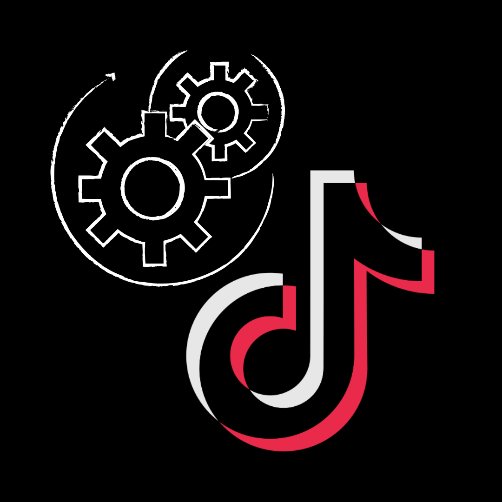

# Auto Click Automation Tool 🤖📱


**Auto Click** is a powerful automation application developed using Flutter. It leverages Android's **Accessibility Service** to perform complex automated gestures, clicks, and interactions. The app is designed to handle repetitive tasks and manage social media interactions (like TikTok) efficiently through a smart task-based system.

---

## ✨ Key Features

* **⚙️ Advanced Automation:** Automate clicks and gestures across various applications using native Accessibility Services.
* **🔗 TikTok Integration:** Dedicated system for managing and executing tasks related to TikTok links, including likes, follows, and comments.
* **📱 Device Management:** Monitor device status and connection in real-time.
* **📋 Task Management:** Sophisticated task queue system (Waiting, Execution, and History) with a centralized controller.
* **🎯 Custom Gesture Configuration:** Highly customizable gesture positions and durations for precise automation control.
* **🛡️ Secure Access:** Integrated authentication system to manage user roles and permissions (Admin/User).
* **🖥️ System Overlay:** Functional overlay UI to control automation without leaving the target application.

---

## 🛠️ Tech Stack & Architecture

* **Framework:** Flutter (Android focused)
* **Language:** Dart & Kotlin (for Accessibility Service implementation)
* **Backend:** Firebase (Firestore for link management & Authentication)
* **State Management:** Provider / Custom Controllers
* **Services:** * `AutoClickAccessibilityService`: Custom Kotlin implementation for system-level interaction.
    * `TaskExecutionService`: Core logic for calculating and triggering events.
    * `QRScannerService`: Integrated QR system for server/device linking.

---

## 📸 App Preview

<p align="center">
  
</p>

*(Screenshots of the automation interface and dashboard will be added soon...)*

---

## 🚀 Getting Started (For Developers)

1. **Clone the repository:**
   ```bash
   git clone [https://github.com/your-username/auto_click.git](https://github.com/your-username/auto_click.git)
